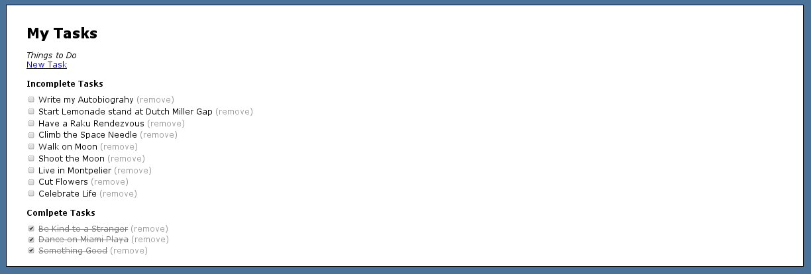

Implenting jQuery and AJAX
==========================

Setup
-----

* bundle
* rake db:setup
* rails s
* Use rails 3.2.16
* Requires Ruby 1.9.2 or later to run.

Implements an ajaxified Check List
----------------------------------

